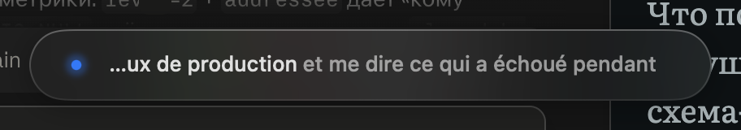

<div align="center">

# Monsieur

**English, monsieur — do you speak it?**

Dictation for macOS that hands you the language you needed, not the one you thought in.



</div>

---

Speak French. Get English. Speak Russian, Hindi, Portuguese — get English, or
whatever language you asked for, typed straight into whatever field your cursor
was already sitting in.

That is the whole idea. You think fastest in your own language, and the prompt,
the pull request comment, and the message to your colleague all need to be in
another one. Monsieur removes the step in between: talk, and finished text
appears where you were about to type.

It also works perfectly well if you only ever speak one language — it is a good
dictation tool first, and the translation is what it does on the way.

## Install

```bash
git clone https://github.com/Evgeny-/monsieur.git
cd monsieur
make cert   # once — a self-signed certificate, so macOS remembers your permissions
make run    # build, install to /Applications, launch
```

A setup window asks for one API key and the language you speak. macOS will ask
for Microphone and Accessibility permission.

## Using it

Put the cursor anywhere. Press `⌃⌥Space`. Talk. Press it again.

| | |
|---|---|
| `⌃⌥Space` | Dictate and translate |
| `⌃⌥⇧Space` | Dictate verbatim, no model involved |

Both are set by pressing the combination you want, not by typing its name.

## What it does beyond typing what you said

**Talks back to you mid-sentence.** Say *"…and make that more formal"* and the
finished text is more formal, with the instruction removed. Say it in any
language. Anything else the transcript happens to contain — including text you
read aloud that sounds like an instruction — is treated as words, not commands.

**Learns your vocabulary.** Terms your recogniser mangles go in a glossary, used
twice: to bias the recogniser before it transcribes, and to correct whatever
still came out wrong afterwards. `engine x` becomes `nginx`.

**Cleans up speech.** Filler words, false starts, the three times you restarted
the sentence — gone. Punctuation and paragraphs where you would have put them.

**Stops when you tell it to.** By hotkey, by a spoken phrase in your language, or
after a pause, if you want that.

## Under the hood

Transcription streams while you talk, through **ElevenLabs Scribe** or
**OpenAI** — so by the time you stop, only the rewrite is left to wait for.
That rewrite runs on **Anthropic**, **OpenAI**, or anything on **OpenRouter**,
and is optional; without it you get the raw transcript.

Roughly a second and a half from the moment you stop speaking, on a small model.
Configuration is a readable JSON file you can edit by hand. There are five
on-screen overlay designs if you care, and it stays out of the way if you don't.

## Development

```bash
make run       # build, install, launch
make logs      # live log stream
swift test
```

Plain SwiftPM, no Xcode project. [CONTRIBUTING.md](CONTRIBUTING.md) to get
started; [docs/internals.md](docs/internals.md) for why the awkward parts are
built the way they are.

## License

MIT — see [LICENSE](LICENSE).
